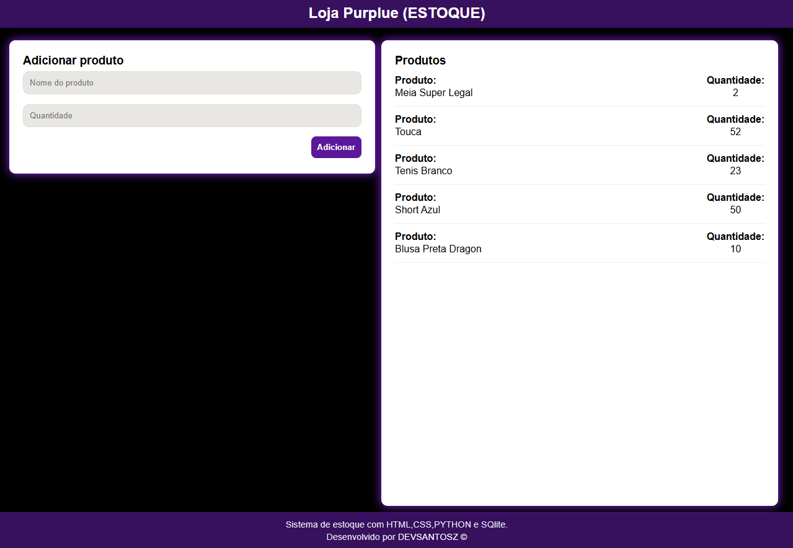

### 🛒 Sistema de Estoque - Loja Purplue

Aplicação web simples para controle de estoque desenvolvida com Python, Flask, SQLite, HTML e CSS.

O sistema permite adicionar produtos e visualizar a lista de itens cadastrados no banco de dados.

## 🚀 Tecnologias Utilizadas
<ul>
  <li>Python 3</li>
  <li>Flask</li>
  <li>SQLite</li>
  <li>HTML5</li>
  <li>CSS3</li>
</ul>

## Imagem do Projeto:

## 📌 Funcionalidades

✔ Adicionar novos produtos  
✔ Definir quantidade inicial 
✔ Listagem automática de produtos cadastrados 
✔ Banco de dados persistente com SQLite 
✔ Interface responsiva com CSS Grid 

## 🎯 Objetivo do Projeto

Este projeto foi desenvolvido com foco em:
<ul>
  <li>Praticar Flask e rotas</li>
  <li>Trabalhar com SQLite</li>
  <li>Estruturar templates com Jinja2</li>
  <li>Aplicar CSS Grid em layout responsivo</li>
  <li>Consolidar fundamentos de CRUD</li>
</ul>

## 📈 Melhorias Futuras

<ul>
   <li>Editar produtos</li>
   <li>Remover produtos</li>
   <li>Sistema de login</li>
   <li>Controle de entrada/saída de estoque</li>
   <li>Deploy em produção (Render / Vercel / Railway)</li>
</ul>
